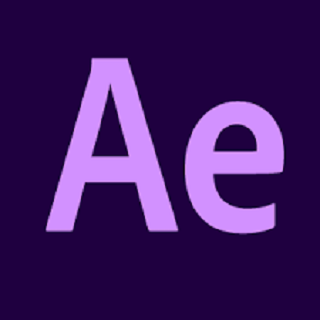

  
  

### 
<h2>iPuppyYT</h2>
  
  
   

## What Am I Doing Now ?

 
  

## My Skill Set  
<table><tr><td valign="top" width="33%">

### Frontend  

  
  
  
  
 
  
  

</td><td valign="top" width="33%">

### Backend  

  
  
  
  

  

</td></tr></table>  

 

 

## Featured

   &nbsp;&nbsp;&nbsp; 

  
## Support Me 

  

  
  

  

## Connect with me  

  

  
  
 

## LinkedIn

 
 
             

## Game Profiles

 
  

  
## Discord Bots

 
  
     &nbsp;&nbsp;&nbsp;&nbsp;&nbsp;  
  
   &nbsp;&nbsp;&nbsp;&nbsp;&nbsp; 
 

## Github Stats  

  
   
  

## Stats

<table style="border:2px dashed green" ><tr><td valign="top" width="40%">

   
### GitHub Profile

</td><td valign="top" width="40%">

  
### YouTube Stats

</td></tr></table>

##  Experienced In

  
  
     &nbsp;&nbsp;&nbsp;&nbsp;&nbsp;
        &nbsp;&nbsp;&nbsp;&nbsp;&nbsp;
        &nbsp;&nbsp;&nbsp;&nbsp;&nbsp;  
        &nbsp;&nbsp;&nbsp;&nbsp;&nbsp;
          &nbsp;&nbsp;&nbsp;&nbsp;&nbsp;
            &nbsp;&nbsp;&nbsp;&nbsp;&nbsp;
             &nbsp;&nbsp;&nbsp;&nbsp;&nbsp;
  
  

  
   
   
  

  
   # Suggested Videos
   
   
 
  
    
  
  

  
  # Support Server
  
  
 
  
  

  
  

  

 

